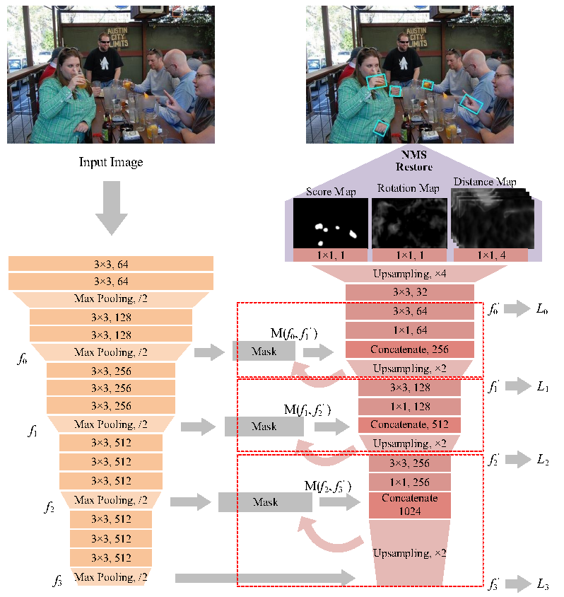

Scale Invariant Fully Convolutional Network: Detecting Hands Efficiently
=====
Introduction
-----
This is a tensorflow implementation of Scale Invariant Fully Convolutional Network: Detecting Hands Efficiently.  
A new Scale Invariant Fully Convolutional Network (SIFCN) trained in an end-to-end fashion is proposed to detect hands efficiently.We design the UF (Unweighted Fusion) block and CWF (Complementary Weighted Fusion) block to fuse features of multiple layers efficiently. The SIFCN architecture with VGG16 backbone: 

### Citation
If you use our code or models, please cite our paper.  

	@

Decription of files
-----
|file/directory|discription|
|--------|--------|
|lanms/                |A C++ version of NMS|
|nets/                 |Contains Resnet V1 model and VGG16 model|
|data_util.py          |A base data generator|
|oxford.py　　　　　    |Data processor for Oxford dataset|
|image_augmentation.py |Various image augmentation methods|
|resnet_v1_model_dice_multi.py                        |ResNet50+UF+Multi-Scale Model|
|resnet_v1_model_dice_multi_weighted_fusion.py        |ResNet50+CWF+Multi-Scale Model|
|vgg16_model_dice_multi.py                            |VGG16+UF+Multi-Scale Model|
|vgg16_model_dice_multi_weighted_fusion.py            |VGG16+CWF+Multi-Scale Model|
|multigpu_train_dice_multi.py                         |Train ResNet50+UF+Multi-Scale Loss|
|multigpu_train_dice_multi_weighted_fusion.py         |Train ResNet50+CWF+Multi-Scale Loss|
|multigpu_train_vgg16_dice_multi.py                   |Train VGG16+UF+Multi-Scale Loss|
|multigpu_train_vgg16_dice_multi_weighted_fusion.py   |Train VGG16+CWF+Multi-Scale Loss|
|eval_all_ckpt_dice_multi.py						  |Evaluate ResNet50+UF+Multi-Scale Loss|
|eval_all_ckpt_dice_multi_weighted_fusion.py		  |Evaluate ResNet50+CWF+Multi-Scale Loss|
|eval_all_ckpt_vgg16_dice_multi.py					  |Evaluate VGG16+UF+Multi-Scale Loss|
|eval_all_ckpt_vgg16_dice_multi_weighted_fusion.py	  |Evaluate VGG16+CWF+Multi-Scale Loss|

Installation
------
Tensorflow > 1.0  
python3

Download
-----
**Data preparing**: [Oxford Hand Dataset](http://www.robots.ox.ac.uk/~vgg/data/hands), 
[VIVA Hand Dataset](http://cvrr.ucsd.edu/vivachallenge/index.php/hands/hand-detection)   

**Pretrained model**: 
You can download from the [slim](https://github.com/tensorflow/models/tree/master/research/slim) page.  

Train
-----

Test
-----

Troubleshooting
-----
* 
	* 